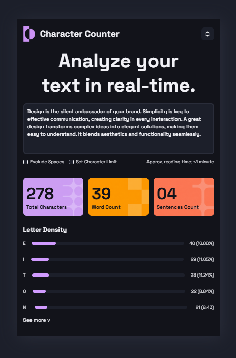

# Proyecto de Maquetado Web - Character Counter

## Objetivo del proyecto

El objetivo principal del proyecto es el maquetado de un diseño previamente dado, utilizando HTML y CSS. 
Se  busca integrar los conceptos de:
- Maquetado Semántico.
- Uso de Flexbox y/o Grid.
- Diseño responsive básico.
- Estilización avanzada en CSS.
- Organización y buenas prácticas.

## Tecnologías utilizadas
- CSS
- HTML
- Google Fonts

## Estructura HTML

Body
└── Card
    ├── Header
    │   ├── brand
    │   │   ├── img
    │   │   └── h1
    │   └── button
    │       └── img
    │
    └── section
        ├── h2
        ├── textarea
        ├── options
        │   ├── check
        │   │   ├── div
        │   │   │   ├── checkbox
        │   │   │   └── label
        │   │   └── div
        │   │       ├── checkbox
        │   │       └── label
        │   └── p
        │
        ├── counter
        │   ├── total
        │   │   ├── p number
        │   │   └── p description
        │   ├── word
        │   │   ├── p number
        │   │   └── p description
        │   └── sentence
        │       ├── p number
        │       └── p description
        │
        └── letter-density
            ├── h3
            ├── statistics
            │   ├── div
            │   │   ├── level
            │   │   ├── meter
            │   │   └── p
            │   ├── div
            │   │   ├── level
            │   │   ├── meter
            │   │   └── p
            │   ├── div
            │   │   ├── level
            │   │   ├── meter
            │   │   └── p
            │   ├── div
            │   │   ├── level
            │   │   ├── meter
            │   │   └── p
            │   └── div
            │       ├── level
            │       ├── meter
            │       └── p
            └── button

## Estructura CSS

El criterio para estilizar la página fue de arriba hacia abajo y de afuera hacia adentro.

Principalmente se establecieron variables CSS y se modificaron en el body los valores por defecto de padding, margin y font.

Durante todo el estilado se utilizó Flexbox para posicionar los elementos.

Luego, cada sección/elemento fue estilado respetando sus características básicas y las pautas visuales del diseño a replicar.

body
└── card
    ├── header
    │   ├── brand
    │   └── img
    ├── button
    │   └── img
    └── section
        ├── h2
        ├── textarea
        ├── placeholder
        ├── options
        │   └── check
        ├── counter
        │   ├── total
        │   ├── word
        │   └── sentence
        └── letter-density
            ├── h3
            ├── statistics
            │   └── meter
            └── button

## Dificultades encontradas:

- Estilado de componentes con diseño predeterminado:
  - textarea
  - meter
  - checkbox

- Uso de Flexbox, selección incorrecta de elementos debido a la cantidad de clases y etiquetas anidadas.

- Centrado de la card de forma responsive.

## captura del resultado final:
